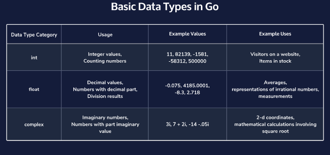
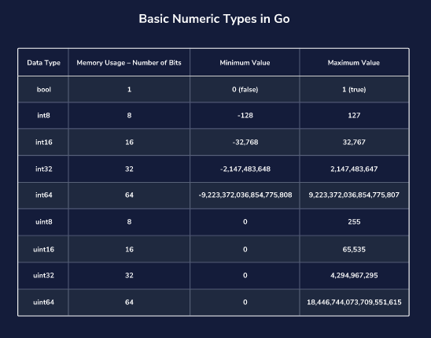

# Learn Go

Learn how to use Go (Golang), an open-source programming language supported by Google!

## Why Learn Go?

Go (or Golang) is an open source programming language designed to build fast, reliable, and efficient software at scale.

Google uses Go specifically for its large networks of servers, and Go also powers much of Google’s own cloud platform. Developers use Go in application development, web development, in operations and infrastructure teams, and much more. It is the language of Cloud Native infrastructure and software development.

As Go’s popularity and adoption continue to increase, we’ll see even greater usage and more creative implementations of the language!

## Take-Away Skills:

In this course, we will cover:

- The setup of a Go environment and how to create a Go file.
- Go’s data types and variables.
- Go’s conditional statements.
- Using functions in Go.

## LESSON 1 Learn Go: Introduction

Get go ing by learning the basics of Google’s very own programming language, Go!

Exercises

- [x] 1. From the Get Go

- [x] 2. Compiling

- [x] 3. Running Files

- [x] 4. Basic Go Structure: Packages

- [x] 5. Basic Go Structure: main

- [x] 6. Importing Multiple Packages

- [x] 7. Comments

- [x] 8. Go Resources

## LESSON 2 Learn Go: Variables and Types

Learn all about the different types and variables in Go by building fundamental programming knowledge.

Exercises

- [x] 1. Values and Variables

- [x] 2. Literals

- [x] 3. Constants

- [x] 4. What is a Data Type?

- [x] 5. Basic Numeric Types in Go

- [x] 6. What is a Variable?

- [x] 7. Reading Go Errors

- [x] 8. Assigning Variables

- [x] 9. Strings

- [x] 10. Zero Values

- [x] 11. Inferring Type

- [x] 12. Default int Type

- [x] 13. Updating Variables

- [x] 14. Multiple Variable Declaration

## LESSON 3 Learn Go: fmt Package

Explore more of Go’s fmt package methods!

Exercises

- [x] 1. The fmt Package

- [x] 2. The Print Method

- [x] 3. The Printf Method

- [x] 4. Different Verbs

The format 'verbs' are derived from C's but are simpler. [their documentation](https://golang.org/pkg/fmt/#hdr-Printing)

- [x] 5. Sprint and Sprintln

- [x] 6. The Sprintf Method

- [x] 7. Getting User Input

## LESSON 4 Learn Go: Conditionals

If you want to learn how to include conditionals into your Go program, take this lesson! Else, you can use this lesson to review conditionals.

Exercises

- [x] 1. What are Conditionals?

Conditionals check on values and, depending on their status (if the values turn out to be true or false), executes an appropriate block of code in response.

- [x] 2. The if Statement

- [x] 3. The else Statement

- [x] 4. Comparison Operators

| Operator   | Meanig:     |
| ---------- | ----------  |
| ==         | Is equal to |
| !=         | Is NOT equal to   |

- [x] 5. Comparison Operators Continued

| Operator   | Meanig:     |
| ---------- | ----------  |
| <          | Less than   |
| >          | Greater than   |
| <=         | Less than or equal to   |
| >=         | Greater than or equal to   |

- [ ] 6. Logical Operators (And, Or)

- [ ] 7. Logical Operators (Not)

- [ ] 8. The else if Statement

- [ ] 9. The switch Statement

- [ ] 10. Scoped Short Declaration Statement

- [ ] 11. Randomizing

- [ ] 12. Seeding

---

[Documentation The Go programming language](https://golang.org/doc/)

[Guide for developing Go locally](https://www.codecademy.com/articles/setting-up-go-locally)
